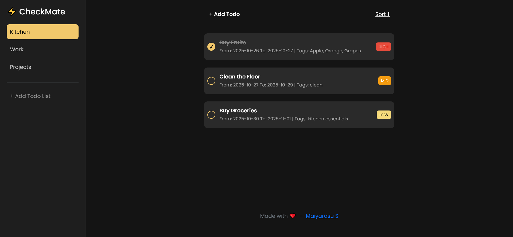

<h1 align="center">CheckMate</h1>

A fast and flexible web-based todo list app. No account required.
 

## Features

### 🏷️ Todo Properties

Create todo with 4 properties: Name, Date, Priority and Tag. Press Enter to add it to list. Click the circle to mark it as done.

### 🗂️ Multiple Lists

Create multiple lists for different purposes: daily todo list, long-term goal list or even project feature list.

### 💾 Local Data Saving

Your data will be stored on your device locally and not persisted in any database.
